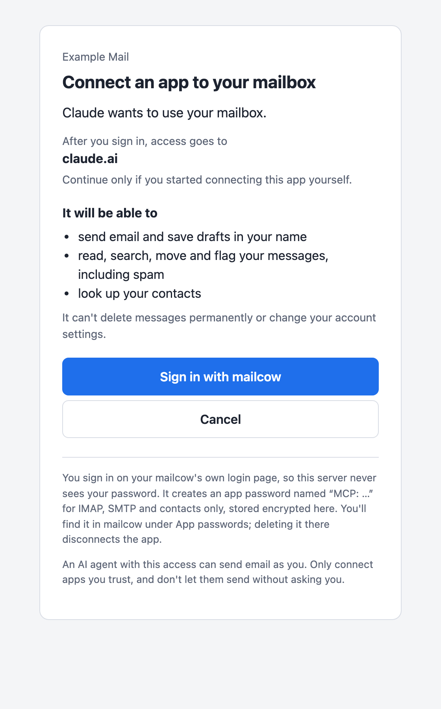

# mailcow MCP

A self-hosted **remote MCP server for [mailcow](https://mailcow.email)**. Users connect their
mailbox to any MCP client (Claude, Cursor, VS Code, Claude Code, …) by URL and sign in with their
mailcow account. An AI agent can then **send, draft, read and follow up on email**: attachments
(including PDFs rendered on the server), reply tracking, rescuing replies from spam and
quarantine, delivery status and contacts.

> **Status: 0.1.0, first release.** Tested against a real Dovecot/Postfix and a mock
> of mailcow's API; a first real-world deployment is still to come, so treat it as early.

> This is a community project. It is not affiliated with or endorsed by the mailcow team or
> The Infrastructure Company GmbH.

<p align="center">
  <picture>
    <source media="(prefers-color-scheme: dark)" srcset="docs/images/consent-dark.png">
    
  </picture>
</p>

## How it works

- **No installs, no passwords handed to third parties.** Add `https://mcp.example.com/mcp` to the
  client, click **Sign in with mailcow**, sign in on mailcow's own login page (2FA included).
  mailcow-mcp creates an app password named `MCP: <app> (…)` for IMAP, SMTP and contacts only;
  the user sees it in mailcow and can delete it any time.
- **Each user acts only as their own mailbox.**
- **The mailcow API key never sits in an internet-facing process.** A small internal broker holds
  it and can only create and delete app passwords for mailboxes that signed in, and read their
  quarantine and delivery log, proven by signed capability tokens.
- **Any MCP client works**: Streamable HTTP with the standard MCP authorization (OAuth 2.1,
  dynamic client registration, PKCE).
- **Generic mode** runs against any IMAP/SMTP server with a password sign-in.

Tools: `send_email`, `save_draft`, `send_draft`, `delete_draft`, `list_folders`,
`list_messages`, `search_messages`, `read_message`, `get_attachment`, `find_replies`,
`get_thread`, `mark_messages`, `move_messages`, `list_spam`, `rescue_from_junk`,
`release_from_quarantine`, `delete_from_quarantine`, `delivery_status`, `my_addresses`,
`find_contacts`. See [docs/tools.md](docs/tools.md).

## 5-minute quick start (mailcow)

On the mailcow server, with a DNS record `mcp.example.com` pointing to it:

```sh
git clone https://github.com/nitramxx/mailcow-mcp /opt/mailcow-mcp-src
mkdir -p /opt/mailcow-mcp && cp /opt/mailcow-mcp-src/deploy/mailcow/* /opt/mailcow-mcp/
cd /opt/mailcow-mcp
./setup-mailcow.sh --hostname mcp.example.com      # read-only: shows what it will do
```

It prints the remaining steps with exact values: add the name to `ADDITIONAL_SAN`, create an
OAuth2 app and enable the API key in the mailcow UI, allowlist the app in Fail2ban. Then:

```sh
./setup-mailcow.sh --hostname mcp.example.com \
    --oauth-client-id <ID> --oauth-client-secret <SECRET> --api-key <KEY> --apply
docker compose up -d
(cd /opt/mailcow-dockerized && docker compose restart nginx-mailcow)
```

The full guide, with a check and troubleshooting for every step:
[docs/deploy-mailcow.md](docs/deploy-mailcow.md). Connecting clients: [docs/clients.md](docs/clients.md).

**Supported mailcow versions:** 2026-07 and later.

## Security model in short

- Two containers from one image: the **app** (behind mailcow's nginx; no API key) and the
  **broker** (internal network only; the API key; a fixed list of mailbox-scoped operations).
- Access tokens last an hour, refresh tokens rotate, credentials are encrypted at rest, tokens are
  stored as hashes. Connections end after 30 days without use.
- Email content returned to the model is marked as untrusted to blunt prompt injection; sending
  and releasing tools are marked destructive so clients ask first. **Don't choose "always allow"
  for them.**
- SMTP is always authenticated; mail server certificates are always verified.

Details, threat model and what is stored: [docs/security.md](docs/security.md).

## Documentation

- [Deploy next to mailcow](docs/deploy-mailcow.md) · [generic mode with Caddy](docs/deploy-generic.md)
- [Connect clients](docs/clients.md) · [Tools](docs/tools.md) · [Configuration](docs/configuration.md)
- [Security](docs/security.md) · [Upgrading](docs/upgrading.md)
- [Uživatelská příručka (česky)](docs/cs/uzivatelska-prirucka.md)
- For contributors: [CONTRIBUTING.md](CONTRIBUTING.md), [mailcow API notes](docs/development/mailcow-api.md)

## Development

Requires [uv](https://docs.astral.sh/uv/); integration tests need Docker.

```sh
uv sync
scripts/check              # lint, format, types, tests
```

Run it locally in generic mode against any IMAP server, then connect an MCP client (for example
[MCP Inspector](https://github.com/modelcontextprotocol/inspector)) to `http://localhost:8090/mcp`:

```sh
mkdir -p data
MODE=generic PUBLIC_URL=http://localhost:8090 TRUSTED_PROXIES=127.0.0.1 DATA_DIR=./data \
  IMAP_HOST=imap.example.org SMTP_HOST=smtp.example.org \
  ENC_KEY=$(uv run mailcow-mcp generate-key) uv run mailcow-mcp serve
```

## License

[MIT](LICENSE)
